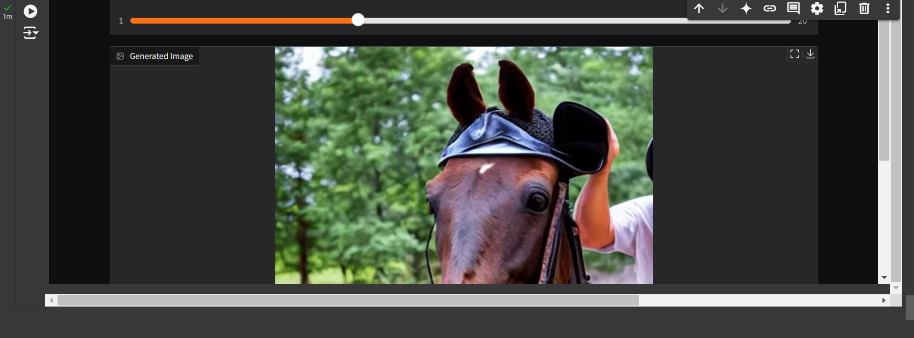

## Prototype Development for Image Generation Using the Stable Diffusion Model and Gradio Framework
## AIM
To develop a prototype that utilizes the Stable Diffusion model for generating images from text prompts and integrate it with an interactive Gradio-based user interface.

## PROBLEM STATEMENT
The task involves creating a user-friendly interface where users can input text descriptions (prompts) to generate high-quality, realistic images using the Stable Diffusion model. The prototype aims to demonstrate the capabilities of the model while ensuring ease of interaction through Gradio.

##  STEPS
### Step 1: Set Up Environment
 - Install the required libraries (diffusers, transformers, torch, gradio).
 - Verify GPU support for running Stable Diffusion.
### Step 2: Load the Stable Diffusion Model
 - Use the diffusers library to load the Stable Diffusion pipeline.
### Step 3: Define the Gradio Interface
 - Design the user interface to accept text prompts and generate corresponding images.
 - Add parameters for customization (e.g., number of inference steps, guidance scale).
### Step 4: Integrate the Model with the Interface
 - Connect the Stable Diffusion model to the Gradio interface for real-time inference.
### Step 5: Deploy and Test
 - Launch the Gradio application locally or on a server.
 - Test with diverse prompts to ensure functionality.
## PROGRAM
```python

# Import required libraries
import torch
from diffusers import StableDiffusionPipeline
import gradio as gr

# Step 1: Load the Stable Diffusion model
def load_model():
    model_id = "runwayml/stable-diffusion-v1-5"
    device = "cuda" if torch.cuda.is_available() else "cpu"
    pipe = StableDiffusionPipeline.from_pretrained(model_id, torch_dtype=torch.float16)
    pipe = pipe.to(device)
    return pipe

# Initialize the pipeline
pipe = load_model()

# Step 2: Define the image generation function
def generate_image(prompt, num_inference_steps=50, guidance_scale=7.5):
    """
    Generates an image based on the text prompt using Stable Diffusion.
    """
    image = pipe(prompt, num_inference_steps=num_inference_steps, guidance_scale=guidance_scale).images[0]
    return image

# Step 3: Set up Gradio Interface
def main():
    with gr.Blocks() as demo:
        gr.Markdown("## Stable Diffusion Image Generator")
        
        # Input elements
        prompt = gr.Textbox(label="Enter your prompt", placeholder="Describe the image you'd like to generate")
        num_steps = gr.Slider(10, 100, value=50, step=1, label="Number of Inference Steps")
        guidance = gr.Slider(1.0, 20.0, value=7.5, step=0.5, label="Guidance Scale")
        
        # Output element
        output_image = gr.Image(label="Generated Image")
        
        # Button to generate image
        generate_btn = gr.Button("Generate Image")
        
        # Define button behavior
        generate_btn.click(fn=generate_image, inputs=[prompt, num_steps, guidance], outputs=output_image)
    
    # Launch the app
    demo.launch()

# Run the Gradio app
if __name__ == "__main__":
    main()
```
## OUTPUT



## RESULT
The prototype successfully demonstrates text-to-image generation using Stable Diffusion, providing an interactive and user-friendly interface. Users can modify parameters to influence the output quality and style.

